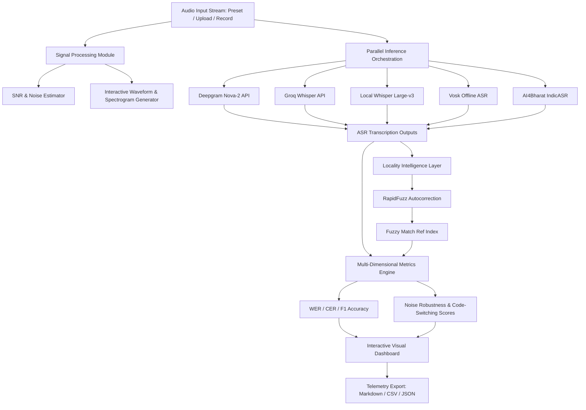

# NammaVoice AI 🎙️
### Multilingual Speech Recognition & Locality Intelligence Benchmarking Platform

NammaVoice AI is an end-to-end, research-oriented ASR evaluation and analytics engine engineered specifically for Indian hiring, voice telephony, and delivery pipelines. The system evaluates five major Automatic Speech Recognition (ASR) engines on complex, real-world Indian conversational speech containing Bangalore locality names spoken in Hindi, Hinglish, Kannada, and code-switched styles.

---

## 🌟 Key Features

1. **Multi-Model Orchestration**: Benchmark Deepgram Nova-2 (as baseline), Whisper Large-v3 (local), Groq Whisper API, Vosk Offline, and AI4Bharat IndicASR side-by-side.
2. **Locality Intelligence Layer**: Post-processes acoustic transcriptions with a **RapidFuzz** phonetic alignment layer to detect and autocorrect heavily accents-slurred or clipped Bangalore localities (e.g., *"Koramangal"* ➔ **Koramangala**, *"white field"* ➔ **Whitefield**).
3. **Advanced Signal Analysis**: Real-time evaluation of audio profiles including Interactive Waveform Plotting, spectrogram generation via Short-Time Fourier Transform (STFT), and automatic Signal-to-Noise Ratio (SNR) estimation in dB.
4. **Multi-Dimensional Metrics**: Beyond standard Word Error Rate (WER) and Character Error Rate (CER), NammaVoice AI computes composite indicators including **Locality F1 Accuracy**, **Noise Robustness Index**, and **Code-Switching Handling Score**.
5. **Interactive Research Dashboard**: Complete glassmorphic, dark-themed Streamlit analytics UI equipped with interactive Plotly visual charts (WER/CER comparisons, Speed-Accuracy scatter plots, performance Radar charts, and Locality Recognition Grid Heatmaps).
6. **Failure Analysis suite**: Word-level omissions and phonetic substitution alignment tables highlighting specific model failures under stressful environmental conditions.
7. **Enterprise Export Capabilities**: Generation and instant download of Markdown research reports, CSV metrics matrices, and structured JSON telemetry logs.

---

## 📐 System Architecture



---

## 📊 Evaluation Methodology & Metrics

* **Word Error Rate (WER)**: Computes the minimum edit distance at word-level divided by total words:
  $$\text{WER} = \frac{S + D + I}{N}$$
* **Character Error Rate (CER)**: Measures character-level edit distance, crucial for capturing regional phonetic variances.
* **Locality F1 Accuracy**: Entity precision and recall based on expected vs. detected Bangalore localities.
* **Noise Robustness Score (0-100)**: Evaluates how well a model maintains high word-level accuracy under low Signal-to-Noise Ratio (SNR) environments (such as busy street traffic).
* **Code-Switching Handling Score (0-100)**: Evaluates transcript fidelity for multi-lingual speech mixing Hindi/Kannada with English terms.

---

## 🛠️ Installation & Setup

### Prerequisites
- Python 3.10 or 3.11
- `libsndfile1` library (usually present on Windows, requires apt-get on Linux/Ubuntu)

### Step 1: Clone the Repository
```bash
git clone https://github.com/your-username/NammaVoice-AI.git
cd NammaVoice-AI
```

### Step 2: Install Dependencies
```bash
pip install -r requirements.txt
```

### Step 3: Run the Application
```bash
streamlit run app.py
```

Streamlit will boot up locally and display:
```text
  Local URL: http://localhost:8501
  Network URL: http://192.168.1.100:8501
```

---

## 📖 Evaluation Model Details

| Model | Source | Primary Deployment Use Case |
| :--- | :--- | :--- |
| **Deepgram Nova-2** | Cloud API | Live real-time telephony, sub-500ms IVRs, and high-velocity candidate screenings. |
| **Whisper Large-v3** | Local / Cloud | Highly precise asynchronous transcriptions, post-interview reports, and compliance indexing. |
| **Groq Whisper API** | Cloud LPU | Ultra-fast (<700ms) execution of Whisper Large-v3, combining high-speed and semantic precision. |
| **Vosk Offline ASR** | Local | On-premise air-gapped systems, secure offline customer data compliance, and mobile/edge devices. |
| **AI4Bharat IndicASR** | Hugging Face | Multi-lingual regional hiring pipelines with dominant Indian accents and heavy regional dialect code-switching. |

---

## 🛡️ CI/CD Pipeline & Automated Testing

The repository comes equipped with an automated CI/CD pipeline (`.github/workflows/ci.yml`) to test the ASR pipelines. The automated tests verify:
- Accurate Word Error Rate and Character Error Rate tracking under standard jiwer norms.
- Robust fuzzy matching and autocorrection for Bangalore locality names across noisy variations.
- Correct F1 Entity accuracy behavior.
- Clean synthetic Signal-to-Noise (SNR) calculation.

To run tests locally:
```bash
python tests/test_pipeline.py
```

---

## 🚀 Future Roadmap
1. **Custom Vocabulary Injection**: Hot-word boosting for Bangalore locality terms directly into Deepgram and Whisper API calls.
2. **Language Diarization**: Multi-speaker segmentation to separate candidate and interviewer streams in telephony calls.
3. **Pydantic Validation**: Introduce rigorous schema validation for extracted addresses and coordinates.
4. **Production API Gateway**: Dockerize and expose the ASR evaluation pipeline as a scalable FastAPI endpoint.

---
